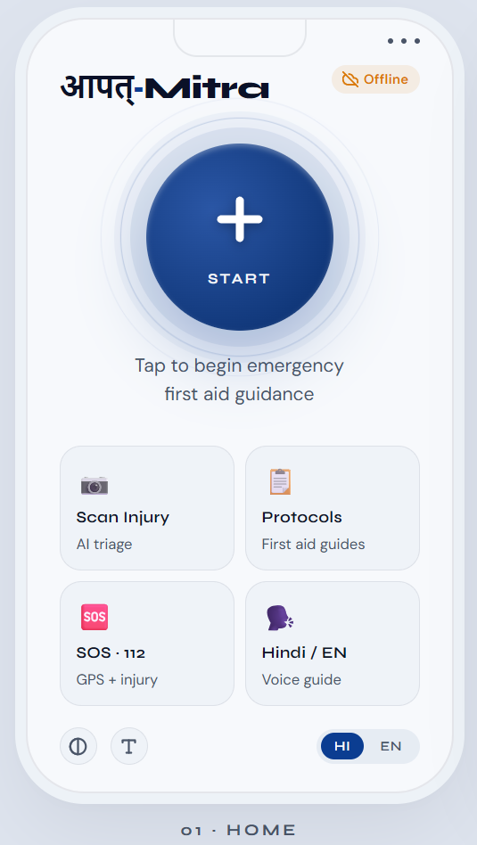
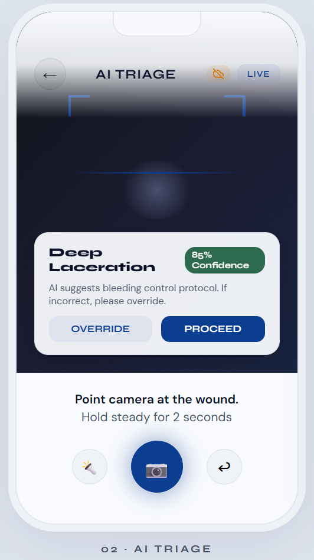
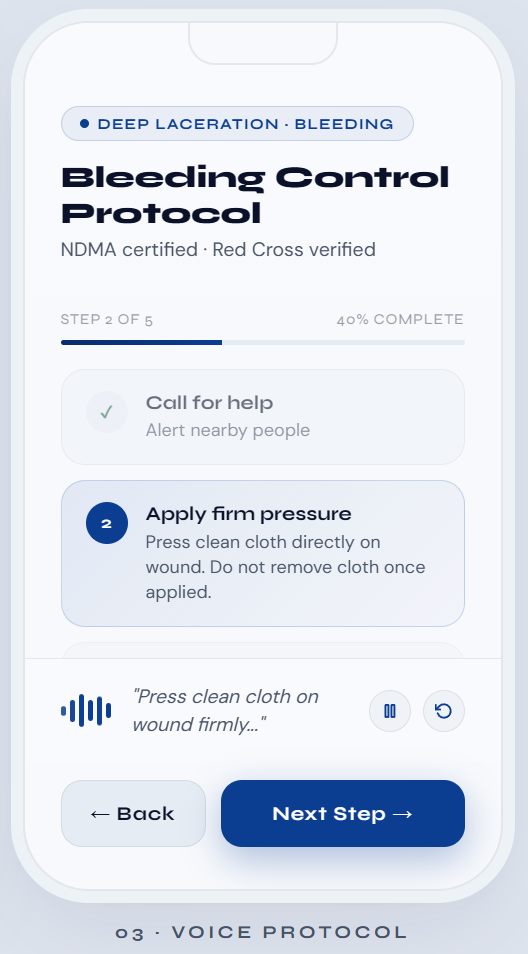
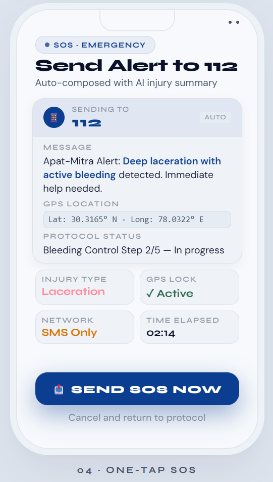

# आपत्·Mitra — Apat-Mitra

**Offline-first first-aid prototype for fast protocol guidance on mobile.** *Built for Graph-e-thon 3.0 (Track 1: Intelligent Health & Learning)*

Apat-Mitra is a React + Vite PWA prototype designed for emergency bystander support. The current build focuses on a believable end-to-end flow that can be demonstrated on a phone: choose or capture an injury photo, route to a first-aid protocol, hear spoken steps, and open an SMS draft for 112 with the current protocol state.

## What This Prototype Does

- Opens as a mobile-friendly PWA shell
- Loads bundled protocol JSON files for bleeding, burns, CPR, and fractures
- Lets the user capture or upload an injury photo on supported devices
- Shows a Gemini-style prototype triage badge and routes with local prototype rules plus manual override
- Supports manual protocol override before opening guidance
- Uses browser SpeechSynthesis for spoken step playback when available
- Uses browser geolocation to add coordinates to the SOS message when permission is granted
- Opens the phone's SMS composer with a prefilled 112 message
- Caches the app shell and protocol JSON files for repeat use offline after first load

## What Is Still Mocked Or Limited

- There is no live Gemini or backend inference in this repo today
- Photo analysis uses local prototype rules and manual fallback, not medical AI
- Voice recognition is not implemented
- SMS sending still depends on the device's native SMS app
- Offline use is strongest after the first successful load and cache fill

## Screens

| Home | Triage | Protocol | SOS |
| --- | --- | --- | --- |
|  |  |  |  |

## Tech Stack

- React 18
- Vite 4
- Plain CSS
- Service Worker + Cache API
- IndexedDB for local protocol copies
- Web Speech API for spoken guidance
- `navigator.geolocation` for SOS location
- `sms:` URI composition for emergency messages

## Project Structure

```text
APAT-MITRA/
├── public/
│   ├── icon.svg
│   ├── manifest.json
│   ├── sw.js
│   └── protocols/
│       ├── bleeding.json
│       ├── burns.json
│       ├── cpr.json
│       └── fracture.json
├── src/
│   ├── components/
│   ├── context/
│   ├── screens/
│   ├── styles/
│   ├── App.jsx
│   ├── main.jsx
│   └── pwaInit.js
└── README.md
```

## Getting Started

```bash
npm install
npm run dev
```

For the best demo:

1. Open the app on a phone or in responsive device mode.
2. Visit the camera screen and capture or upload a sample image.
3. Open a protocol and verify spoken playback.
4. Visit SOS and allow location access.
5. Tap the SMS button to open the prefilled 112 draft.

## Build

```bash
npm run build
```

## Next Steps

- Replace local photo routing with a real vision API or on-device model
- Add multilingual protocol content instead of only UI language toggles
- Add explicit offline health indicators and cache status
- Add test coverage for protocol loading, voice controls, and SOS composition
